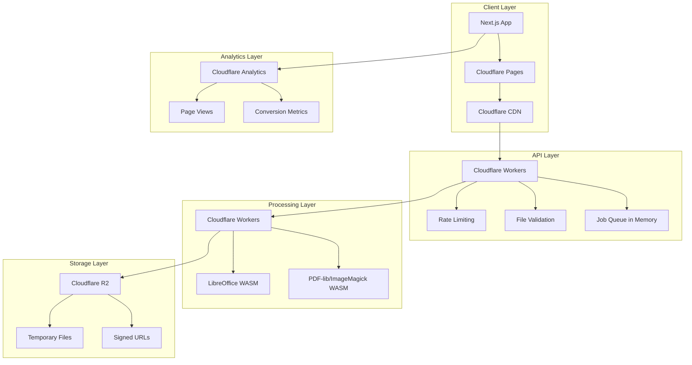
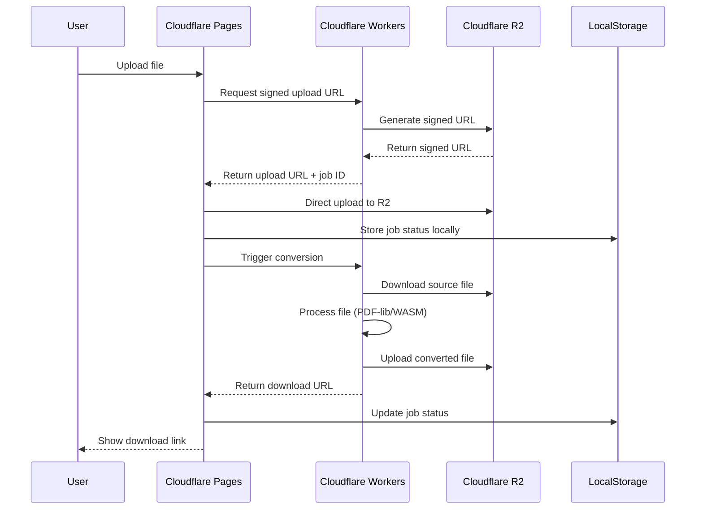

# Design Document

## Overview

파일 변환 플랫폼은 **DB 없는 완전 서버리스 아키텍처**를 채택합니다. 회원가입 없는 익명 서비스로, 모든 상태는 클라이언트 사이드와 임시 스토리지에서만 관리됩니다. Next.js 기반의 프론트엔드는 Cloudflare Pages에 배포되고, 파일 변환 처리는 Cloudflare Workers와 R2 Storage만으로 구현하여 비용을 최소화합니다.

## Architecture



### Technology Stack

**Frontend:**
- Next.js 14 (App Router, SSR/SSG)
- TypeScript
- Tailwind CSS
- React Hook Form (파일 업로드)

**Deployment & CDN:**
- Cloudflare Pages (정적 사이트 호스팅)
- Cloudflare CDN (글로벌 캐싱)
- Cloudflare Workers (API 엔드포인트 + 파일 처리)

**Storage:**
- Cloudflare R2 (임시 파일 저장)
- 클라이언트 LocalStorage (세션 상태)

**File Processing:**
- PDF-lib (PDF 조작, 브라우저/Worker에서 실행)
- LibreOffice WASM (문서 변환, Worker에서 실행)
- Canvas API (이미지 처리, 브라우저에서 실행)

**Analytics:**
- Cloudflare Analytics (기본 트래픽 분석)
- Google Analytics 4 (상세 사용자 분석)
- 클라이언트 사이드 이벤트 추적

## Components and Interfaces

### Frontend Components

```typescript
// 파일 업로드 컴포넌트
interface FileUploadProps {
  acceptedTypes: string[];
  maxSize: number;
  onUpload: (file: File) => Promise<void>;
}

// 변환 진행 상황 컴포넌트
interface ConversionProgressProps {
  jobId: string;
  onComplete: (downloadUrl: string) => void;
}

// 광고 컴포넌트
interface AdComponentProps {
  placement: 'header' | 'loading' | 'download';
  adUnitId: string;
}
```

### API Interfaces

```typescript
// Cloudflare Workers API
interface ConversionRequest {
  fileKey: string;
  sourceFormat: 'pdf' | 'docx' | 'doc';
  targetFormat: 'pdf' | 'docx';
  options?: {
    ocr?: boolean;
    quality?: 'fast' | 'balanced' | 'high';
  };
}

interface ConversionResponse {
  jobId: string;
  status: 'queued' | 'processing' | 'completed' | 'failed';
  estimatedTime?: number;
  downloadUrl?: string;
  error?: string;
}

// Supabase Edge Function
interface ProcessingJob {
  id: string;
  user_session: string;
  source_file_path: string;
  target_format: string;
  status: JobStatus;
  created_at: string;
  completed_at?: string;
  result_file_path?: string;
  error_message?: string;
}
```

## Data Models

### Client-Side State Management

```typescript
// 클라이언트 LocalStorage에 저장되는 세션 상태
interface ConversionSession {
  sessionId: string;
  jobs: ConversionJob[];
  createdAt: string;
}

interface ConversionJob {
  id: string;
  fileName: string;
  sourceFormat: string;
  targetFormat: string;
  status: 'uploading' | 'processing' | 'completed' | 'failed';
  uploadedAt: string;
  completedAt?: string;
  downloadUrl?: string;
  error?: string;
  fileSize: number;
}
```

### Cloudflare R2 Storage Structure

```
buckets/
├── uploads/
│   └── {job-id}.{ext}          # 업로드된 원본 파일 (1시간 TTL)
└── results/
    └── {job-id}.{ext}          # 변환된 결과 파일 (24시간 TTL)
```

### Analytics Data (Client-Side Events)

```typescript
// Google Analytics 4로 전송되는 이벤트
interface AnalyticsEvent {
  event_name: 'file_upload' | 'conversion_start' | 'conversion_complete' | 'file_download' | 'ad_click';
  parameters: {
    file_type?: string;
    file_size?: number;
    conversion_type?: string;
    processing_time?: number;
    ad_placement?: string;
    session_id: string;
  };
}
```

## Correctness Properties

*A property is a characteristic or behavior that should hold true across all valid executions of a system-essentially, a formal statement about what the system should do. Properties serve as the bridge between human-readable specifications and machine-verifiable correctness guarantees.*

Based on the prework analysis, the following properties have been identified after eliminating redundancy:

**Property 1: File validation consistency**
*For any* uploaded file, validation should accept only files that match the expected format and are within size limits, rejecting all others consistently
**Validates: Requirements 1.1, 2.1**

**Property 2: Job creation for valid uploads**
*For any* valid file upload, a conversion job should be created and added to the processing queue
**Validates: Requirements 1.2**

**Property 3: Signed URL generation for completed jobs**
*For any* completed conversion job, a signed URL should be generated that provides access to the converted file
**Validates: Requirements 1.3**

**Property 4: Download tracking completeness**
*For any* file download event, the system should track the successful completion in analytics
**Validates: Requirements 1.4**

**Property 5: OCR option availability for scanned PDFs**
*For any* PDF detected as containing scanned images, OCR processing options should be made available to the user
**Validates: Requirements 1.5**

**Property 6: Format preservation in conversion**
*For any* Word document converted to PDF, the resulting PDF should preserve the original formatting, layout, and styling
**Validates: Requirements 2.2, 2.3, 2.5**

**Property 7: Error handling with retry options**
*For any* conversion that fails, the system should provide clear error messages and retry options to the user
**Validates: Requirements 2.4**

**Property 8: File encryption during storage and transmission**
*For any* uploaded file, the system should encrypt the file both during storage and transmission
**Validates: Requirements 3.1**

**Property 9: Automatic file deletion after 24 hours**
*For any* file uploaded more than 24 hours ago, the system should automatically delete it from storage
**Validates: Requirements 3.2**

**Property 10: Immediate deletion on user request**
*For any* user request for immediate file deletion, the system should remove the files instantly
**Validates: Requirements 3.3**

**Property 11: No permanent storage of user content**
*For any* file processing operation, the system should ensure no user content remains in permanent storage after processing
**Validates: Requirements 3.4**

**Property 12: Signed URL usage with expiration**
*For any* file access requirement, the system should use signed URLs with proper expiration times
**Validates: Requirements 3.5**

**Property 13: Real-time progress updates**
*For any* conversion job that starts, the system should display real-time progress updates to the user
**Validates: Requirements 4.1**

**Property 14: Immediate completion notification**
*For any* conversion that completes, the system should notify the user immediately
**Validates: Requirements 4.2**

**Property 15: Download performance within 3 seconds**
*For any* download request, the system should provide the file within 3 seconds
**Validates: Requirements 4.3**

**Property 16: Queue order preservation**
*For any* set of jobs submitted simultaneously, the system should process them in the correct queue order
**Validates: Requirements 4.4**

**Property 17: Time estimation for long conversions**
*For any* conversion that exceeds expected processing time, the system should provide estimated completion time
**Validates: Requirements 4.5**

**Property 18: Non-intrusive advertisement display**
*For any* user visit to the conversion page, the system should display non-intrusive advertisements
**Validates: Requirements 5.1**

**Property 19: Relevant ads during conversion**
*For any* conversion in progress, the system should show relevant advertisements during the waiting time
**Validates: Requirements 5.2**

**Property 20: Native ads on download pages**
*For any* download page that loads, the system should include native advertisement content
**Validates: Requirements 5.3**

**Property 21: Ad metrics tracking**
*For any* advertisement interaction, the system should measure RPM, conversion rates, click-through rates, and revenue
**Validates: Requirements 5.4, 8.3**

**Property 22: Auto-scaling with traffic increases**
*For any* increase in traffic, the system should automatically scale processing resources
**Validates: Requirements 6.1**

**Property 23: Queue status communication**
*For any* situation where the processing queue is full, the system should inform users of expected wait times
**Validates: Requirements 6.2**

**Property 24: Premium user prioritization**
*For any* resource limitation scenario, the system should prioritize premium users over free users
**Validates: Requirements 6.3**

**Property 25: Automatic job retry on failure**
*For any* processing error that occurs, the system should automatically retry the failed job
**Validates: Requirements 6.4**

**Property 26: Page load performance within 2 seconds**
*For any* page visit, the system should load the page within 2 seconds
**Validates: Requirements 7.1**

**Property 27: Responsive design on mobile devices**
*For any* access from mobile devices, the system should provide responsive design
**Validates: Requirements 7.2**

**Property 28: Low bandwidth optimization**
*For any* user with slow internet connection, the system should optimize for low bandwidth usage
**Validates: Requirements 7.3**

**Property 29: Basic functionality without JavaScript**
*For any* user with JavaScript disabled, the system should provide basic functionality
**Validates: Requirements 7.4**

**Property 30: Static resource caching for returning users**
*For any* returning user, the system should cache static resources for faster loading
**Validates: Requirements 7.5**

**Property 31: User interaction tracking**
*For any* user interaction with the platform, the system should track page views and conversion rates
**Validates: Requirements 8.1**

**Property 32: Conversion metrics logging**
*For any* completed conversion, the system should log processing times and success rates
**Validates: Requirements 8.2**

**Property 33: System error alerting**
*For any* system error that occurs, the system should alert administrators immediately
**Validates: Requirements 8.4**

**Property 34: Performance diagnostic information**
*For any* detected performance issue, the system should provide detailed diagnostic information
**Validates: Requirements 8.5**

## Error Handling

### File Processing Errors
- **Invalid file format**: Clear error message with supported format list
- **File size exceeded**: Specific size limit information and premium upgrade option
- **Corrupted file**: Retry suggestion and file integrity check guidance
- **Processing timeout**: Automatic retry with queue position update

### System Errors
- **Storage failures**: Automatic failover to backup storage
- **Processing service unavailable**: Queue management with estimated wait times
- **Network issues**: Retry mechanism with exponential backoff
- **Rate limiting**: Clear messaging about limits and premium options

### User Experience Errors
- **Slow network**: Progressive loading and compression options
- **Browser compatibility**: Graceful degradation and alternative methods
- **JavaScript disabled**: Server-side fallback functionality

## Testing Strategy

### Dual Testing Approach

The testing strategy employs both unit testing and property-based testing to ensure comprehensive coverage:

**Unit Testing:**
- Specific examples demonstrating correct behavior
- Integration points between components
- Edge cases and error conditions
- API endpoint validation

**Property-Based Testing:**
- Universal properties that should hold across all inputs
- Minimum 100 iterations per property test
- Random input generation for comprehensive coverage
- Each property test tagged with corresponding design property

**Property-Based Testing Library:**
- **JavaScript/TypeScript**: fast-check library
- Configuration: Minimum 100 iterations per test
- Tagging format: `**Feature: file-conversion-platform, Property {number}: {property_text}**`

**Testing Framework:**
- **Unit Tests**: Jest with React Testing Library
- **Integration Tests**: Playwright for end-to-end scenarios
- **Property Tests**: fast-check for property-based testing
- **Performance Tests**: Lighthouse CI for Core Web Vitals

### Test Categories

**File Processing Tests:**
- Conversion accuracy and format preservation
- Error handling for various file types and sizes
- Performance benchmarks for different file sizes

**Security Tests:**
- File encryption validation
- Signed URL expiration and access control
- Automatic deletion verification

**Performance Tests:**
- Page load times under various conditions
- Conversion processing times
- Concurrent user handling

**Integration Tests:**
- Cloudflare Workers API endpoints
- Supabase Edge Functions
- Storage operations and cleanup

Each correctness property will be implemented as a single property-based test, ensuring that the universal behaviors hold across all valid inputs and system states.

### Deployment Architecture

**완전 Cloudflare 기반 스택:**
- **Cloudflare Pages**: Next.js 정적 사이트 호스팅 및 SSR
- **Cloudflare Workers**: API 엔드포인트 + 파일 변환 처리
- **Cloudflare R2**: 임시 파일 저장 (자동 TTL 삭제)
- **Cloudflare Analytics**: 트래픽 및 성능 모니터링
- **Cloudflare KV**: 간단한 설정 및 캐시 (선택적)

**비용 최적화:**
- **DB 없음**: PostgreSQL 비용 완전 제거
- **서버리스**: 사용한 만큼만 과금
- **자동 스케일링**: 트래픽에 따른 자동 확장
- **글로벌 CDN**: 전 세계 빠른 접근

### File Processing Pipeline



### API Design

**Cloudflare Workers Endpoints:**

```typescript
// GET /api/upload-url
interface UploadUrlRequest {
  fileName: string;
  fileSize: number;
  contentType: string;
}

interface UploadUrlResponse {
  uploadUrl: string;
  fileKey: string;
  sessionId: string;
}

// POST /api/convert
interface ConvertRequest {
  fileKey: string;
  sourceFormat: 'pdf' | 'docx' | 'doc';
  targetFormat: 'pdf' | 'docx';
  sessionId: string;
  options?: ConversionOptions;
}

interface ConvertResponse {
  jobId: string;
  estimatedTime: number;
  queuePosition: number;
}

// GET /api/status/:jobId
interface StatusResponse {
  jobId: string;
  status: 'queued' | 'processing' | 'completed' | 'failed';
  progress: number; // 0-100
  downloadUrl?: string;
  error?: string;
}
```

**Cloudflare Workers Functions:**

```typescript
// convert-pdf-to-word worker
export default {
  async fetch(request: Request, env: Env): Promise<Response> {
    const { fileKey, options } = await request.json();
    
    // Download file from R2
    const sourceFile = await env.R2_BUCKET.get(fileKey);
    if (!sourceFile) {
      return new Response('File not found', { status: 404 });
    }
    
    // Process with PDF-lib or LibreOffice WASM
    const convertedFile = await processFile(await sourceFile.arrayBuffer(), options);
    
    // Upload result to R2 with 24h TTL
    const resultKey = `results/${crypto.randomUUID()}.docx`;
    await env.R2_BUCKET.put(resultKey, convertedFile, {
      customMetadata: { 'ttl': '86400' } // 24 hours
    });
    
    // Generate signed URL for download
    const downloadUrl = await generateSignedUrl(resultKey, 3600); // 1 hour
    
    return new Response(JSON.stringify({ 
      success: true, 
      downloadUrl,
      resultKey 
    }));
  }
};
```

### Advertisement Integration

**Google AdSense Integration:**
```typescript
// components/AdUnit.tsx
interface AdUnitProps {
  slot: string;
  placement: 'header' | 'loading' | 'download';
  responsive?: boolean;
}

export function AdUnit({ slot, placement, responsive = true }: AdUnitProps) {
  useEffect(() => {
    // AdSense 스크립트 로드 및 광고 표시
    if (typeof window !== 'undefined' && window.adsbygoogle) {
      window.adsbygoogle.push({});
    }
  }, []);

  return (
    <div className={`ad-container ad-${placement}`}>
      <ins
        className="adsbygoogle"
        style={{ display: 'block' }}
        data-ad-client="ca-pub-xxxxxxxxxx"
        data-ad-slot={slot}
        data-ad-format={responsive ? 'auto' : 'rectangle'}
      />
    </div>
  );
}
```

**Revenue Tracking:**
```typescript
// utils/analytics.ts
export async function trackAdRevenue(placement: string, revenue: number) {
  // Google Analytics 4로 이벤트 전송
  gtag('event', 'ad_revenue', {
    event_category: 'monetization',
    event_label: placement,
    value: revenue,
    currency: 'KRW',
    session_id: getSessionId()
  });
  
  // 로컬 스토리지에도 저장 (선택적)
  const analytics = JSON.parse(localStorage.getItem('analytics') || '{}');
  analytics.totalRevenue = (analytics.totalRevenue || 0) + revenue;
  localStorage.setItem('analytics', JSON.stringify(analytics));
}
```

### Performance Optimization

**Cloudflare Optimizations:**
- **Auto Minify**: HTML, CSS, JavaScript 자동 압축
- **Brotli Compression**: 텍스트 파일 압축
- **Image Optimization**: Cloudflare Polish로 이미지 최적화
- **Caching Rules**: 정적 자산 장기 캐싱

**Next.js Optimizations:**
```typescript
// next.config.js
module.exports = {
  experimental: {
    appDir: true,
  },
  images: {
    domains: ['supabase-storage-url'],
    formats: ['image/webp', 'image/avif'],
  },
  async headers() {
    return [
      {
        source: '/(.*)',
        headers: [
          {
            key: 'Cache-Control',
            value: 'public, max-age=31536000, immutable',
          },
        ],
      },
    ];
  },
};
```

### Security Implementation

**File Upload Security:**
```typescript
// workers/upload-validator.ts
export async function validateFile(file: File): Promise<ValidationResult> {
  // MIME type validation
  const allowedTypes = ['application/pdf', 'application/vnd.openxmlformats-officedocument.wordprocessingml.document'];
  if (!allowedTypes.includes(file.type)) {
    return { valid: false, error: 'Invalid file type' };
  }

  // File size validation
  const maxSize = 50 * 1024 * 1024; // 50MB
  if (file.size > maxSize) {
    return { valid: false, error: 'File too large' };
  }

  // File signature validation
  const signature = await getFileSignature(file);
  if (!isValidSignature(signature, file.type)) {
    return { valid: false, error: 'File signature mismatch' };
  }

  return { valid: true };
}
```

**Data Encryption:**
```typescript
// utils/encryption.ts
export async function encryptFile(file: ArrayBuffer): Promise<ArrayBuffer> {
  const key = await crypto.subtle.generateKey(
    { name: 'AES-GCM', length: 256 },
    false,
    ['encrypt', 'decrypt']
  );
  
  const iv = crypto.getRandomValues(new Uint8Array(12));
  const encrypted = await crypto.subtle.encrypt(
    { name: 'AES-GCM', iv },
    key,
    file
  );
  
  return encrypted;
}
```

### Monitoring and Analytics

**클라이언트 사이드 분석:**
```typescript
// utils/analytics.ts
export class Analytics {
  private sessionId: string;
  
  constructor() {
    this.sessionId = this.getOrCreateSessionId();
  }
  
  // Google Analytics 4 이벤트 전송
  trackEvent(eventName: string, parameters: Record<string, any>) {
    gtag('event', eventName, {
      ...parameters,
      session_id: this.sessionId,
      timestamp: Date.now()
    });
  }
  
  // 변환 완료 추적
  trackConversion(conversionType: string, fileSize: number, processingTime: number) {
    this.trackEvent('conversion_complete', {
      conversion_type: conversionType,
      file_size: fileSize,
      processing_time: processingTime
    });
  }
  
  // 광고 클릭 추적
  trackAdClick(placement: string) {
    this.trackEvent('ad_click', {
      ad_placement: placement
    });
  }
}
```

**Cloudflare Analytics 대시보드:**
```typescript
// workers/analytics.ts
export async function getAnalytics(env: Env): Promise<AnalyticsData> {
  // Cloudflare Analytics API 호출
  const response = await fetch(`https://api.cloudflare.com/client/v4/zones/${env.ZONE_ID}/analytics/dashboard`, {
    headers: {
      'Authorization': `Bearer ${env.CF_API_TOKEN}`,
      'Content-Type': 'application/json'
    }
  });
  
  const data = await response.json();
  
  return {
    pageViews: data.result.totals.pageviews.all,
    uniqueVisitors: data.result.totals.uniques.all,
    bandwidth: data.result.totals.bandwidth.all,
    requests: data.result.totals.requests.all
  };
}
```

### Cost Optimization Strategy

**완전 Cloudflare 기반 비용:**
- **Pages**: 무제한 정적 사이트 호스팅 **무료**
- **Workers**: 월 10만 요청까지 **무료**, 이후 $0.50/백만 요청
- **R2 Storage**: 월 10GB까지 **무료**, 이후 $0.015/GB
- **Analytics**: 기본 분석 **무료**

**예상 월 비용 (월 10만 변환 기준):**
- **0-1만 변환/월**: 완전 **무료** (무료 티어 내)
- **1-10만 변환/월**: $0-5 (Workers 약간 초과)
- **10만+ 변환/월**: $5-15 (R2 스토리지 비용 추가)

**비용 절감 효과:**
- ❌ ~~Supabase Pro: $25/월~~ → ✅ **$0/월**
- ❌ ~~PostgreSQL 관리~~ → ✅ **DB 없음**
- ❌ ~~복잡한 인프라~~ → ✅ **단순한 서버리스**

### Scaling Strategy

**트래픽 증가 대응:**
1. **0-10만 PV/월**: 완전 **무료** 티어로 운영
2. **10-100만 PV/월**: $5-15/월 (Workers + R2 약간 초과)
3. **100-1000만 PV/월**: $20-50/월 (Cloudflare Pro 플랜 고려)
4. **1000만+ PV/월**: $100+/월 (Enterprise 플랜)

**수익성 분석 (대폭 개선):**
- **월 10만 PV, RPM 1,000원**: 월 수익 10만원, 비용 **0원** → **순익 10만원** ⬆️
- **월 50만 PV, RPM 1,500원**: 월 수익 75만원, 비용 **10원** → **순익 74만원** ⬆️
- **월 100만 PV, RPM 2,000원**: 월 수익 200만원, 비용 **30원** → **순익 197만원** ⬆️

**핵심 장점:**
- 🚀 **초기 비용 0원**으로 시작 가능
- 📈 **수익성 극대화** (비용 거의 없음)
- ⚡ **자동 스케일링** (서버리스)
- 🌍 **글로벌 CDN** (빠른 속도)