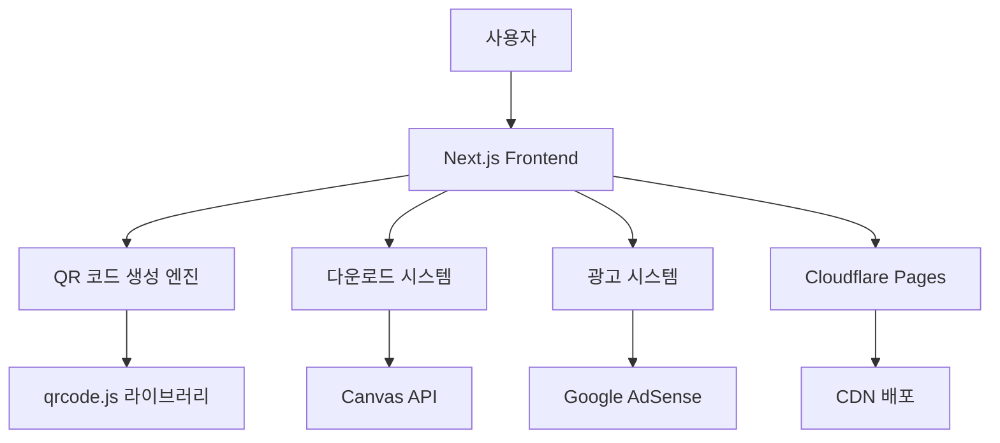

# QR 코드 생성기 설계 문서

## 개요

QR 코드 생성기는 사용자가 텍스트나 URL을 입력하면 즉시 QR 코드를 생성하는 클라이언트 사이드 웹 애플리케이션입니다. 완전한 개인정보 보호, 빠른 성능, 그리고 광고 수익 기반의 무료 서비스를 제공합니다.

## 아키텍처

### 전체 시스템 아키텍처



### 기술 스택

- **Frontend**: Next.js 14 (App Router)
- **QR 생성**: qrcode.js 라이브러리
- **이미지 처리**: Canvas API
- **스타일링**: Tailwind CSS
- **배포**: Cloudflare Pages
- **광고**: Google AdSense
- **다국어**: next-intl

## 컴포넌트 및 인터페이스

### 핵심 컴포넌트

#### 1. QRGenerator 컴포넌트
```typescript
interface QRGeneratorProps {
  initialText?: string;
  locale: 'ko' | 'en';
}

interface QROptions {
  size: 128 | 256 | 512;
  errorCorrectionLevel: 'L' | 'M' | 'Q' | 'H';
  margin: number;
}
```

#### 2. QRPreview 컴포넌트
```typescript
interface QRPreviewProps {
  qrCodeDataURL: string;
  size: number;
  onDownload: () => void;
}
```

#### 3. InputForm 컴포넌트
```typescript
interface InputFormProps {
  value: string;
  onChange: (value: string) => void;
  onGenerate: () => void;
  maxLength: number;
  placeholder: string;
}
```

#### 4. OptionsPanel 컴포넌트
```typescript
interface OptionsPanelProps {
  options: QROptions;
  onChange: (options: QROptions) => void;
}
```

## 데이터 모델

### QR 코드 생성 데이터
```typescript
interface QRCodeData {
  text: string;
  options: QROptions;
  dataURL: string;
  timestamp: number;
}

interface GenerationResult {
  success: boolean;
  dataURL?: string;
  error?: string;
  processingTime: number;
}
```

### 사용자 설정
```typescript
interface UserPreferences {
  language: 'ko' | 'en';
  defaultSize: number;
  defaultErrorCorrection: string;
}
```

## 정확성 속성

*속성은 시스템의 모든 유효한 실행에서 참이어야 하는 특성이나 동작입니다. 속성은 사람이 읽을 수 있는 명세와 기계가 검증할 수 있는 정확성 보장 사이의 다리 역할을 합니다.*

### 속성 1: QR 코드 생성 일관성
*모든* 유효한 텍스트 입력에 대해, QR 코드 생성 함수는 항상 유효한 QR 코드 데이터 URL을 반환해야 합니다.
**검증: 요구사항 1.1**

### 속성 2: URL 검증 정확성
*모든* 입력 문자열에 대해, URL 검증 함수는 유효한 URL은 통과시키고 무효한 URL은 거부해야 합니다.
**검증: 요구사항 1.2**

### 속성 3: 미리보기 동기화
*모든* QR 코드 생성 후, 미리보기 이미지가 DOM에 올바르게 표시되어야 합니다.
**검증: 요구사항 1.3**

### 속성 4: 다운로드 형식 일관성
*모든* 다운로드 요청에 대해, PNG 형식의 유효한 Blob이 생성되어야 합니다.
**검증: 요구사항 1.4**

### 속성 5: 입력 길이 제한
*모든* 텍스트 입력에 대해, 2048자 이하는 허용하고 초과는 거부해야 합니다.
**검증: 요구사항 1.5**

### 속성 6: 크기 변경 반응성
*모든* 크기 옵션 변경에 대해, 미리보기가 해당 크기로 즉시 업데이트되어야 합니다.
**검증: 요구사항 2.2**

### 속성 7: 실시간 재생성
*모든* 설정 변경에 대해, QR 코드가 새로운 설정으로 즉시 재생성되어야 합니다.
**검증: 요구사항 2.5**

### 속성 8: 클라이언트 사이드 처리
*모든* QR 코드 생성 과정에서, 입력 텍스트가 서버로 전송되지 않아야 합니다.
**검증: 요구사항 3.2**

### 속성 9: 데이터 저장 금지
*모든* 생성 작업에서, 사용자 데이터가 서버에 저장되지 않아야 합니다.
**검증: 요구사항 3.4**

### 속성 10: 페이지 로딩 성능
*모든* 페이지 로딩에서, 로딩 시간이 2초를 초과하지 않아야 합니다.
**검증: 요구사항 4.1**

### 속성 11: QR 생성 성능
*모든* 텍스트 입력에 대해, QR 코드 생성 시간이 1초를 초과하지 않아야 합니다.
**검증: 요구사항 4.2**

### 속성 12: 반응형 레이아웃
*모든* 화면 크기에서, 레이아웃이 올바르게 표시되어야 합니다.
**검증: 요구사항 4.3**

### 속성 13: 오프라인 기능
*모든* 네트워크 연결 상태에서, 기본 QR 코드 생성 기능이 작동해야 합니다.
**검증: 요구사항 4.4**

### 속성 14: Core Web Vitals 성능
*모든* 페이지에서, Core Web Vitals 점수가 90점 이상이어야 합니다.
**검증: 요구사항 4.5**

### 속성 15: 광고 독립성
*모든* 광고 로딩 상태에서, 메인 기능이 지연되지 않아야 합니다.
**검증: 요구사항 5.4**

### 속성 16: 모바일 광고 크기
*모든* 모바일 화면에서, 광고가 적절한 크기로 표시되어야 합니다.
**검증: 요구사항 5.5**

### 속성 17: 언어 변경 완전성
*모든* 언어 변경에서, 모든 UI 텍스트가 해당 언어로 번역되어야 합니다.
**검증: 요구사항 6.2**

### 속성 18: 브라우저 언어 감지
*모든* 초기 로딩에서, 브라우저 언어 설정에 따라 적절한 언어가 설정되어야 합니다.
**검증: 요구사항 6.3**

### 속성 19: 오류 메시지 표시
*모든* 잘못된 입력에 대해, 적절한 오류 메시지가 표시되어야 합니다.
**검증: 요구사항 7.3**

### 속성 20: 페이지 로딩 최적화
*모든* 페이지에서, 로딩 속도가 최적화되어야 합니다.
**검증: 요구사항 8.5**

## 오류 처리

### 입력 검증 오류
- 빈 텍스트 입력
- 2048자 초과 입력
- 잘못된 URL 형식

### QR 코드 생성 오류
- 라이브러리 로딩 실패
- Canvas API 지원 없음
- 메모리 부족

### 다운로드 오류
- Canvas 변환 실패
- 브라우저 다운로드 제한
- 파일 시스템 오류

### 오류 처리 전략
```typescript
interface ErrorHandler {
  handleInputError(error: InputError): void;
  handleGenerationError(error: GenerationError): void;
  handleDownloadError(error: DownloadError): void;
  showUserFriendlyMessage(message: string): void;
}
```

## 테스트 전략

### 단위 테스트
- QR 코드 생성 함수 테스트
- URL 검증 로직 테스트
- 입력 길이 제한 테스트
- 다운로드 기능 테스트

### 속성 기반 테스트
- **라이브러리**: fast-check (JavaScript)
- **최소 반복 횟수**: 100회
- **태그 형식**: `**Feature: qr-generator, Property {number}: {property_text}**`

속성 기반 테스트는 다음과 같은 패턴으로 구현됩니다:
- 랜덤 텍스트 생성 → QR 코드 생성 → 유효성 검증
- 다양한 크기 옵션 → 미리보기 업데이트 → 크기 일치 확인
- 언어 변경 → UI 텍스트 확인 → 번역 완전성 검증

### 통합 테스트
- 전체 QR 코드 생성 플로우
- 다국어 지원 기능
- 광고 시스템 통합
- 모바일 반응형 테스트

### 성능 테스트
- 페이지 로딩 시간 측정
- QR 코드 생성 속도 측정
- Core Web Vitals 점수 확인
- 메모리 사용량 모니터링